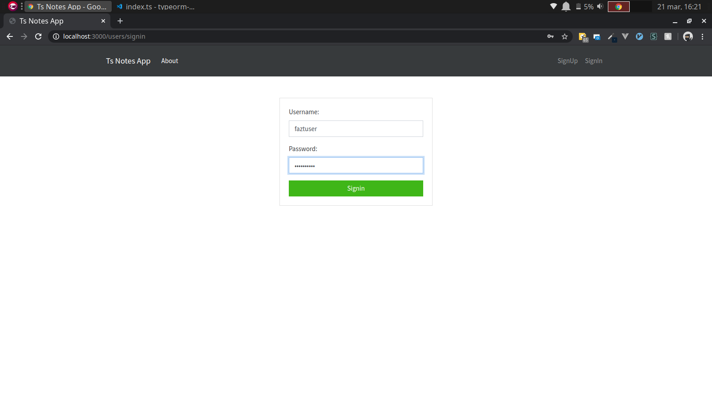
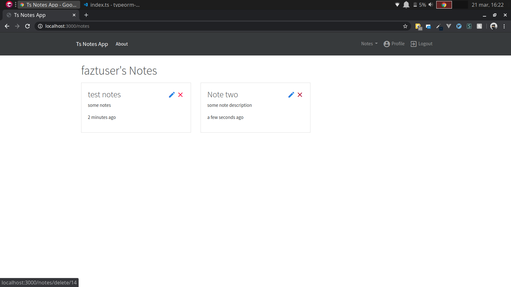

# Typescript, Nodejs & TypeORM Notes App

# Stack
* Nodejs
* TypeORM
* Passport

# Requirements
* create a MySQL database first

# Environment Variables
* NOTES_MYSQL_HOST, the mysql host
* NOTES_MYSQL_USER, the mysql user
* NOTES_MYSQL_PASSWORD, the mysql password
* NOTES_MYSQL_DATABASE, the mysql database